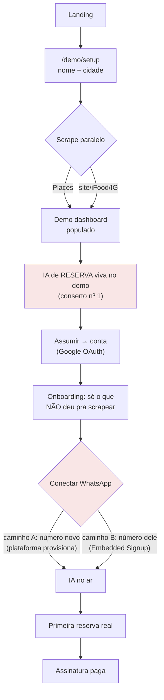

# Onboarding zero-toque — UI/UX do demo + arquitetura completa das integrações

**Premissa que governa tudo:** o fundador mora na Espanha. Qualquer passo que
dependa dele — uma ligação, um "te mando o QR por WhatsApp", um toggle manual —
quebra o produto. O restaurante precisa ir de *nunca ouviu falar* a *IA
atendendo cliente no WhatsApp dele* sozinho. Este documento é a crítica do que
existe (com base no walkthrough real de 28/jul em produção) e a arquitetura do
que falta.

---

## Parte 1 — Crítica de UI/UX do demo (walkthrough real, produção)

### O que já está certo — não mexer

1. **A porta de entrada é imbatível**: nome + cidade → restaurante real do
   Google com 4.7★, 18k avaliações, endereço, telefone, horários — em menos de
   um minuto, sem cadastro, sem cartão. Nenhum concorrente brasileiro
   (Tagme, Getin, Reserv.ai) tem isso. É o momento "uau" e deve continuar
   sendo a PRIMEIRA coisa que acontece.
2. **Painel já populado**: cair num dashboard com reservas, mesas e fila
   simuladas comunica "isto é um sistema vivo", não um formulário vazio.
3. **Avaliações reais do Google na página** ("Anderson Pereira…", "Taty
   Rossi…") — prova social do próprio restaurante, involuntariamente genial.
4. **"Demo Interativa — todas as ações são locais"** — honestidade que evita a
   frustração de "cliquei e não salvou".

### O que estava quebrado (consertado hoje, 28/jul)

| Problema | Estado |
|---|---|
| Dados do Google em inglês (horários AM/PM, descrição) | ✅ consertado — `languageCode` segue o idioma da UI |
| "Casual Dining" na primeira linha do painel | ✅ consertado — mapa de rótulos completo em pt |
| Cartão de insights da IA em inglês ("Emphasize authentic…") | ✅ consertado — prompt exige pt-BR, enums preservados |
| **IA do Gerente do demo respondia ENLATADO** — frontend não mandava `restaurant_id`, toda chamada real morria em 400 e o fallback mascarava | ✅ consertado — id passado, fallback agora loga |
| "Bem-vindo ao assistente do **your restaurant**" | ✅ consertado — nome vem do banco, fallback localizado |

### O que continua errado, em ordem de prioridade

1. **A aba WhatsApp do demo é um teatro de marionetes.** Conversa com roteiro
   fixo, rotulada "Simulação de conversa com IA". O canal que É o produto — a
   tese inteira do Seatable — é a única coisa do demo que não é real.
   Enquanto isso a IA do Gerente (agora consertada) responde de verdade.
   **Inversão de prioridade: a conversa de RESERVA é que deveria ser viva.**
   → Conserto barato (1 dia): reaproveitar o `/api/demo-chat` com o persona de
   RECEPCIONISTA (o mesmo system prompt do WhatsApp real, apontando pros dados
   do demo). O dono digita "quero mesa pra 4 sexta" e vê a IA DELE responder
   com os horários DELE. Sem Meta, sem número — só o chat na tela.
   → Conserto ideal (fase 2): botão "testar no MEU WhatsApp" — dispara uma
   conversa real do número da plataforma para o celular do dono (ele informa o
   número, recebe a mensagem, responde no app de verdade). Custa uma conversa
   de service window por demo. É a conversão mais forte possível: o produto
   funcionando no telefone dele, 60 segundos depois de digitar o nome.

2. **"moderate faixa de preço"** — enum do Google cru na tela. Traduzir o
   rótulo (`moderate` → "preço moderado", `inexpensive` → "econômico" etc.).

3. **Não há caminho do demo para "minha IA no ar".** O CTA é "Criar conta
   grátis"/"Assumir", que leva a login → onboarding de 6 passos. O demo prova
   o painel, mas o momento de mágica (IA respondendo no WhatsApp) só existe
   depois de um funil longo. A Parte 3 redesenha isso.

4. **Métricas simuladas sem rótulo por card.** O aviso "ações são locais" está
   no topo, mas os números (4 reservas, 6 clientes) parecem reais. Um selo
   "exemplo" discreto por card evita a pergunta "de onde saíram essas
   reservas?" — que mina a confiança que o resto construiu.

### O que MOSTRAR no demo (hierarquia de informação)

Ordem do que convence um dono de restaurante, do mais forte pro mais fraco:

1. **O restaurante dele, reconhecido** (nome, foto, nota, avaliações) — prova
   que o sistema o conhece. JÁ EXISTE.
2. **A IA dele conversando** — reserva de ponta a ponta com os dados dele.
   HOJE É TEATRO; é o conserto nº 1.
3. **O que a IA já sabe** (cardápio inferido, pratos citados nas avaliações,
   pontos fortes/fracos) — JÁ EXISTE (AIKnowsCard), agora em português.
4. **Operação do salão** (mesas, fila, walk-in) — JÁ EXISTE.
5. Análises/receita — de menor valor no demo (números inventados não
   convencem ninguém). Manter mínimo.

---

## Parte 2 — O que MAIS dá pra extrair automaticamente (inventário de scraping)

Hoje o pipeline usa Google Places (Text Search + Details + Photos) e o site do
restaurante (extração via Haiku). O que falta, por ordem de valor:

| Fonte | O que rende | Como | Custo/risco |
|---|---|---|---|
| **Google Places — reviews estendidas** | já pega 3–8; pedir `reviews` com paginação rende até ~50 → insights muito melhores | mesma API, campo já no fieldmask | baixo |
| **Cardápio no site** (já parcial) | pratos + PREÇOS → a IA responde "quanto custa a moqueca?" | já existe via Haiku; falta priorizar links `/menu`, `/cardapio`, PDFs | baixo |
| **Instagram público (sem login)** | bio, link, telefone comercial, últimos posts → pratos do momento, eventos, horário especial de feriado | endpoint público `?__a=1` morreu; caminho realista: oEmbed da Meta (aprovação de app) OU Apify/Bright Data (~US$0,002/perfil) | médio — ToS; usar provedor terceirizado licenciado |
| **iFood (página pública do restaurante)** | cardápio COMPLETO com preços e fotos, tempo de entrega, nota no iFood | scraping da página pública (HTML estável) | médio — sem API pública; volume baixo (1 fetch por onboarding) é tolerado na prática |
| **WhatsApp Business (perfil público)** | se o número tem WhatsApp, foto e descrição comercial | lookup via API de contacts da Cloud API (própria Meta) | baixo |
| **TripAdvisor página pública** | nota, ranking na cidade, faixa de preço | fetch simples | baixo |
| **CNPJ (Receita)** | razão social, sócios, CNAE, data de abertura → pré-preenche dados fiscais e valida que o "dono" é dono | JÁ TEMOS o índice carregado (146k estabelecimentos SP) — só ligar no onboarding | zero |
| **Reserve with Google / Maps "reservar"** | qual sistema de reserva o restaurante JÁ usa (Tagme? Getin?) → personaliza o pitch de migração | parsing do botão de reserva no Places | baixo |

**Regra de arquitetura:** cada fonte vira um *enricher* independente com o
mesmo contrato (`enriquecer(restaurante) → {campos, confiança, fonte}`), rodando
em paralelo com timeout próprio, gravando em `scraped_data` JSONB versionado.
Nenhum enricher é bloqueante: o demo abre com o que chegou, o resto preenche
depois (o padrão fire-and-forget do KB sync do ElevenLabs já faz isso).

---

## Parte 3 — Arquitetura do fluxo completo (demo → cliente com IA no ar)

### O funil como máquina de estados

Os dois nós vermelhos são os que não existem hoje.

### 3.1 Do demo à conta — encurtar o onboarding com o que já foi scrapeado

Hoje: demo → login → wizard de 6 passos que **pergunta de novo** o que o
scraper já sabe. Certo: o onboarding vira **confirmação**, não entrevista.

- Passo único "confira seus dados": nome, endereço, horários, cozinha,
  telefone — tudo pré-preenchido do `scraped_data`, editável.
- Mesas: propor layout inicial por heurística (nº de avaliações + faixa de
  preço → estimativa de capacidade; ex.: casual com 18k reviews ≈ 15–25
  mesas). O dono ajusta um número, não desenha um salão.
- CNPJ: campo opcional que autocompleta razão social via índice local.
- Import de CSV continua opcional depois (já existe).

**Meta: da conta criada ao "conectar WhatsApp" em < 3 minutos.**

### 3.2 WhatsApp — a decisão de arquitetura central

O caminho atual (número da plataforma compartilhado, roteado por
`whatsapp_phone_number_id`) funciona mas não escala comercialmente: o cliente
quer O NÚMERO DELE respondendo.

**Caminho A — número novo provisionado pela plataforma (padrão, zero-toque):**
1. No onboarding, a plataforma cria um número novo via Cloud API
   (WABA da plataforma, business verification já feita — a nossa).
2. IA no ar imediatamente nesse número.
3. O restaurante divulga o número novo (bio do Instagram, Google Business,
   etiqueta no balcão — o kit já gera QR).
- Custo: ~US$ 0 (número Cloud API não tem mensalidade da Meta) + conversas.
- Limitação honesta: não é o número histórico do restaurante.

**Caminho B — o número DELE via Embedded Signup (o diferencial):**
1. Botão "Conectar meu WhatsApp" abre o **Embedded Signup da Meta** (popup
   OAuth-like, oficial): o dono loga no Facebook, escolhe/cria o WABA dele,
   migra o número no fluxo guiado da própria Meta.
2. O webhook da plataforma recebe o `phone_number_id` novo → grava no
   registry → roteamento multi-tenant que JÁ EXISTE cuida do resto.
3. **Coexistence (2025+):** a Meta hoje permite o número continuar no app
   WhatsApp Business do celular E na Cloud API ao mesmo tempo — o dono não
   perde o app dele. É exatamente o medo nº 1 ("vou perder meu WhatsApp?").
- Pré-requisitos de plataforma (uma vez, nossos): app da Meta com
  `whatsapp_business_management` aprovado em App Review + Tech Provider
  verification. É burocracia de semanas — **começar o processo AGORA**, é o
  item de maior lead time de todo o plano.
- Do lado do restaurante: zero toque nosso. Ele clica, loga, pronto.

**Decisão recomendada: construir A primeiro (destrava piloto em dias), com B
como upgrade no mesmo botão quando o App Review sair.**

### 3.3 Instagram — canal de entrada, não só fonte de dados

Duas fases, mesma infraestrutura da Meta:

- **Fase 1 (dados, sem aprovação):** enricher do perfil público via provedor
  licenciado — alimenta o demo e a KB da IA (pratos do momento, eventos).
- **Fase 2 (canal):** Instagram Messaging API — a MESMA IA responde DM.
  Arquitetura já está pronta pra isso: `message-processor` é agnóstico de
  canal (adapter pattern; Meta/Twilio hoje). Um `InstagramAdapter` com
  `parseIncoming`/`sendMessage` pluga no pipeline inteiro — sessão, IA,
  ferramentas de reserva, dedup, rate limit, tudo grátis.
  Pré-requisito: `instagram_manage_messages` no App Review (pedir JUNTO com o
  do WhatsApp — uma revisão só).

### 3.4 Camada de análise — o que medir do funil

Instrumentar (PostHog já existe no projeto):

| Métrica | Por quê |
|---|---|
| busca → restaurante encontrado | qualidade do Places por região |
| encontrado → demo criado | atrito do e-mail |
| demo → primeira mensagem na IA viva | o momento-verdade novo |
| demo → "Assumir" | conversão do demo |
| conta → WhatsApp conectado | o funil de ativação REAL |
| WhatsApp → primeira reserva de cliente | ativação de verdade |
| latência e taxa de fallback do demo-chat | o enlatado silencioso de hoje vira métrica vigiada |

O radar de ativação do Racha já provou o modelo: funil com UMA ação de
destravamento por estágio. Replicar para o Seatable com esses estágios.

---

## Parte 4 — Sequência de execução

| # | Item | Esforço | Desbloqueia |
|---|---|---|---|
| 1 | **Submeter App Review da Meta** (Embedded Signup + `instagram_manage_messages`) | burocracia, semanas de fila | B do WhatsApp + Instagram |
| 2 | **IA de reserva VIVA no demo** (persona recepcionista no `/api/demo-chat`) | ~1 dia | o momento-verdade do funil |
| 3 | Onboarding pré-preenchido pelo scrape (confirmação, não entrevista) | ~2 dias | conta em <3 min |
| 4 | Caminho A do WhatsApp (número provisionado + registry) | ~2 dias | primeiro cliente ativável zero-toque |
| 5 | Enrichers: reviews estendidas, iFood, TripAdvisor, CNPJ no onboarding | ~2 dias | demo mais rico + IA mais esperta |
| 6 | Instrumentação do funil (PostHog) | ~1 dia | saber onde morre |
| 7 | "Testar no MEU WhatsApp" (mensagem real pro celular do dono) | ~1 dia | conversão máxima do demo |
| 8 | Embedded Signup (quando App Review sair) | ~3 dias | número do cliente, coexistence |
| 9 | InstagramAdapter no message-processor | ~2 dias | DM respondida pela mesma IA |

Itens 2–7 são independentes do App Review — dá pra ter o funil inteiro
zero-toque funcionando com número provisionado enquanto a Meta processa.

---

## Decisões em aberto (para o fundador)

1. **Custo do "testar no MEU WhatsApp"**: cada teste é uma conversa iniciada
   pela empresa (~R$0,04–0,30). Aceitável por lead? (Recomendo sim — é o CAC
   mais barato possível.)
2. **Instagram por provedor pago** (~US$0,002/perfil via Apify/similar) ou
   esperar o caminho oficial? (Recomendo provedor no enricher, oficial no
   canal.)
3. **Número provisionado**: nome de exibição segue padrão "Reservas — {Nome do
   Restaurante}"? (Verificação de display name da Meta leva ~1 dia.)
